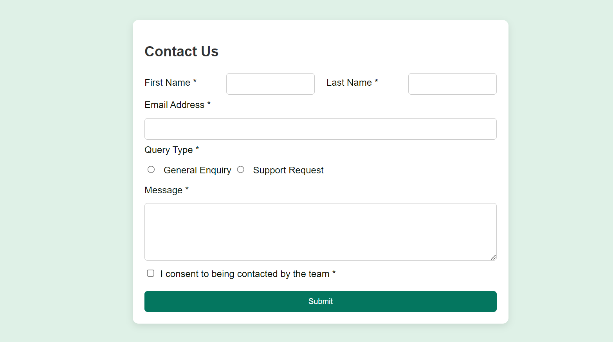
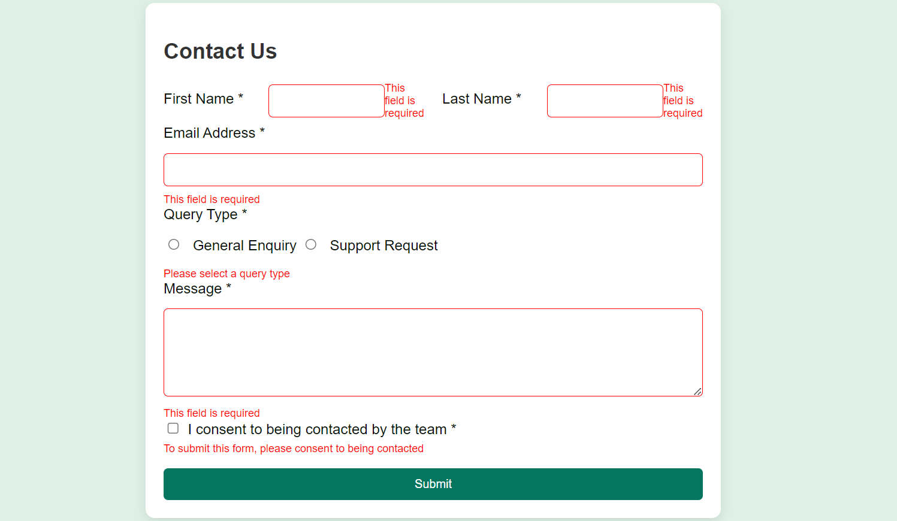
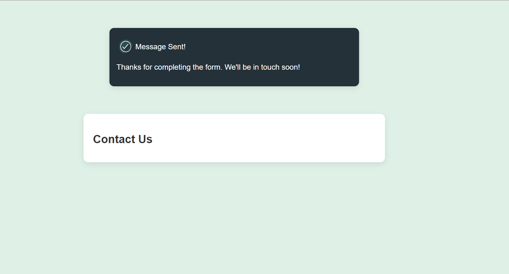

# Frontend Mentor - Contact form solution

This is a solution to the [Contact form challenge on Frontend Mentor](https://www.frontendmentor.io/challenges/contact-form--G-hYlqKJj). Frontend Mentor challenges help you improve your coding skills by building realistic projects. 

## Table of contents

- [Overview](#overview)
  - [The challenge](#the-challenge)
  - [Screenshot](#screenshot)
- [My process](#my-process)
  - [Built with](#built-with)
  - [What I learned](#what-i-learned)
  - [Continued development](#continued-development)
- [Author](#author)

**Note: Delete this note and update the table of contents based on what sections you keep.**

## Overview

### The challenge

Users should be able to:

- Complete the form and see a success toast message upon successful submission
- Receive form validation messages if:
  - A required field has been missed
  - The email address is not formatted correctly
- Complete the form only using their keyboard
- Have inputs, error messages, and the success message announced on their screen reader
- View the optimal layout for the interface depending on their device's screen size
- See hover and focus states for all interactive elements on the page

### Screenshot

<em>Preview of the contact form webpage</em>

<em>Error State</em>

<em>Success State</em>

## My process

### Built with

This was my first experience. So I used HTML, CSS and Javascript to be able to build contact form.

### What I learned

I learned how to use Javascript to improve the working principle of the website. I used it to be able to give errors when any of the inputs is empty, send success message when all the inputs are filled.

### Continued development

I need to learn more concepts in Front-End Web development. I would like to learn more about Javascript. I will try to test out HTML5 for next times to understand its working principle as well. 

## Author
- Website - [Fatima Alakbarli](https://github.com/FatimaAliakberli)
- Frontend Mentor - [@FatimaAliakberli](https://www.frontendmentor.io/profile/FatimaAliakberli)

